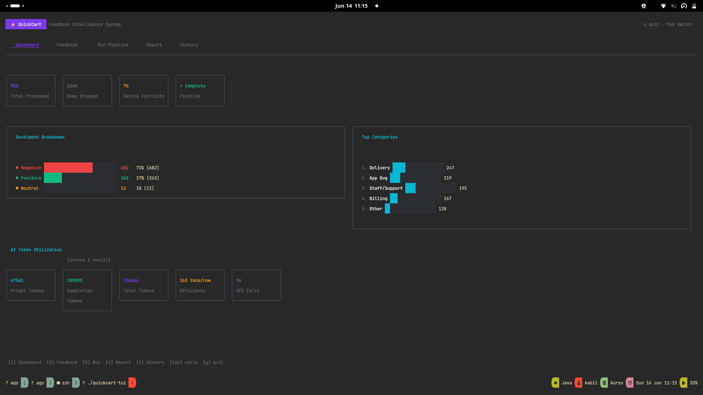
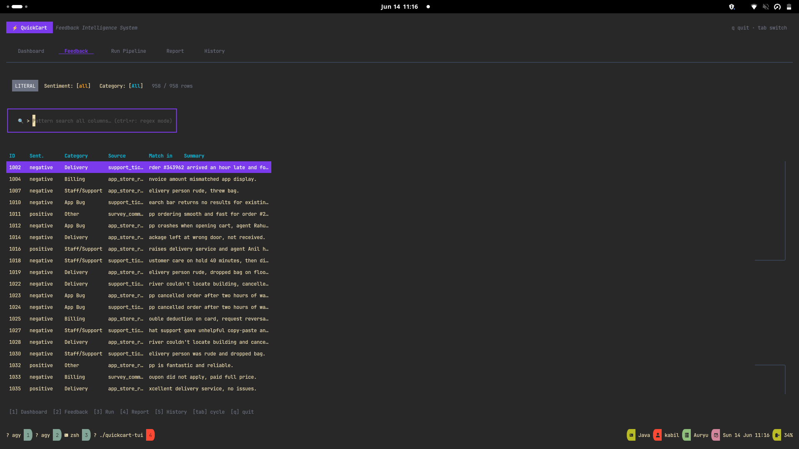
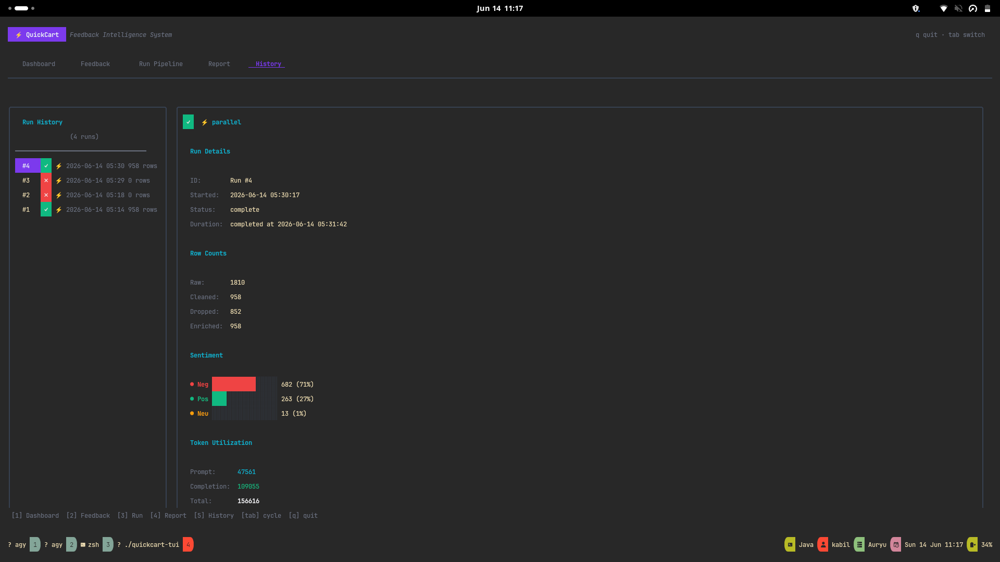

# QuickCart Feedback Intelligence System

> An end-to-end AI-powered customer feedback analytics pipeline with an interactive terminal UI — built for the QuickCart food delivery platform.



---

## What It Does

Ingests 1,810 raw customer feedback rows, cleans them, enriches each one with AI-powered sentiment classification and summarisation, stores results in SQLite, and surfaces everything through a rich 5-tab terminal UI with live pipeline control, regex-powered search, run history, and token utilisation tracking.

| Stage | What happens |
|---|---|
| **Ingest** | Load raw CSV, validate schema |
| **Clean** | Dedup on content hash, drop short/empty rows, normalise timestamps, flag rating contradictions |
| **Enrich** | Classify sentiment + category + summary via NVIDIA API (sequential or ⚡ parallel) |
| **Store** | Write to SQLite `feedback.db`, log run metadata to `runs.db` |
| **Report** | Generate `summary_report.md` with stats |

---

## Prerequisites

| Tool | Version |
|---|---|
| Python | 3.10+ |
| Go | 1.21+ |
| Git | any |

---

## Setup

### 1. Clone the repo

```bash
git clone git@github.com:Kabil777/quick-cart.git
cd quick-cart
```

### 2. Create and activate the virtual environment

```bash
python -m venv venv
source venv/bin/activate        # Linux / macOS
# venv\Scripts\activate.bat    # Windows
```

### 3. Install Python dependencies

```bash
pip install -r requirements.txt
```

### 4. Configure the API key

The pipeline uses the **NVIDIA OpenAI-compatible API** (`openai/gpt-oss-20b`).

Set your key as an environment variable **before** running:

```bash
export NVIDIA_API_KEY="nvapi-your-key-here"
```

Or create a `.env` file in the project root:

```
NVIDIA_API_KEY=nvapi-your-key-here
```

> The key is read via `os.getenv("NVIDIA_API_KEY")` in `config.py`. It is **never committed** to this repository.

---

## Running the Pipeline

### Sequential mode (default)

```bash
source venv/bin/activate
python main.py
```

### ⚡ Parallel mode (faster — recommended)

```bash
python main.py --parallel
```

### Dry run (no API calls, no DB writes)

```bash
python main.py --dry-run
```

### Skip AI enrichment (use placeholders)

```bash
python main.py --skip-ai
```

### All options

```
usage: main.py [-h] [--input INPUT] [--parallel] [--workers N] [--skip-ai] [--dry-run]

  --input INPUT    Path to raw CSV (default: data/customer_feedback_raw.csv)
  --parallel       Run AI enrichment in parallel (ThreadPoolExecutor)
  --workers N      Number of parallel workers (default: 4)
  --skip-ai        Fill with placeholder values instead of calling AI
  --dry-run        Run clean stage only, no output written
```

---

## Running the TUI

### Build

```bash
cd tui
go build -o ../quickcart-tui .
cd ..
```

### Launch

```bash
# Run the pipeline first if feedback.db doesn't exist
./quickcart-tui
```

---

## TUI Screenshots

### Dashboard — Live Stats + AI Token Utilization


The Dashboard shows sentiment breakdown, top categories, pipeline health, and a live **AI Token Utilization** row summarising cumulative token costs across all pipeline runs.

### Feedback — Regex Search Across All Columns



Press `/` to open the search bar. Toggle `ctrl+r` for **REGEX mode** — pattern-match across all 7 columns (`id`, `sentiment`, `category`, `source`, `timestamp`, `summary`, `text`). Matched columns are displayed in the "Match in" column. Press `enter` on any row for a full detail popup.

### History — Per-Run Token Tracking



Every pipeline run is logged to `output/runs.db`. The History tab shows the full run list with status badges (`✓` / `⚡` / `✗`), row counts, sentiment breakdown, and **per-run token utilisation** including prompt/completion split, API call count, retries, and efficiency (tokens/row).

---

## TUI Key Bindings

### Global

| Key | Action |
|---|---|
| `1`–`5` | Switch to tab |
| `tab` | Cycle tabs |
| `q` / `ctrl+c` | Quit |

### Feedback tab

| Key | Action |
|---|---|
| `/` | Open search bar |
| `ctrl+r` | Toggle LITERAL ↔ REGEX mode |
| `s` | Cycle sentiment filter |
| `c` | Cycle category filter |
| `r` | Reset all filters |
| `enter` | Open detail popup |
| `↑` / `↓` | Navigate rows |

### Run Pipeline tab

| Key | Action |
|---|---|
| `enter` | Start sequential run |
| `p` | Start parallel run |

### Report tab

| Key | Action |
|---|---|
| `a` | Toggle Summary Report ↔ AI Log |
| `r` | Reload file |
| `↑` / `↓` | Scroll |

### History tab

| Key | Action |
|---|---|
| `↑` / `↓` / `j` / `k` | Navigate run list |
| `r` | Refresh |

---

## Project Structure

```
quickcart-feedback/
├── data/
│   └── customer_feedback_raw.csv   ← raw input (1,810 rows)
├── output/                          ← generated at runtime
│   ├── feedback.db                  ← enriched data (SQLite)
│   ├── runs.db                      ← pipeline run history
│   ├── cleaned_enriched.csv
│   └── summary_report.md
├── pipeline/
│   ├── ingest.py                    ← Stage 1: load CSV
│   ├── clean.py                     ← Stage 2: dedup, flag, normalise
│   ├── enrich.py                    ← Stage 3: AI classify (parallel-safe)
│   ├── store.py                     ← Stage 4: write to SQLite
│   ├── report.py                    ← Stage 5: generate markdown report
│   └── runs.py                      ← run history tracking
├── tui/
│   ├── main.go                      ← 5-tab Bubble Tea root model
│   ├── db/db.go                     ← SQLite queries
│   └── ui/
│       ├── styles.go                ← dark purple/cyan theme
│       ├── dashboard.go             ← stats + token utilization
│       ├── table.go                 ← regex search, all-column filter
│       ├── runner.go                ← live subprocess stream
│       ├── report.go                ← Glamour markdown renderer
│       └── history.go              ← run list + per-run detail
├── docs/screenshots/
├── main.py                          ← pipeline entry point
├── config.py                        ← env-driven config
├── requirements.txt
├── ai_usage_log.md                  ← submission artifact
├── plan.md                          ← current development plan
└── quickcart-tui                    ← compiled binary (after build)
```

---

## Architecture Decisions

### Why NVIDIA API instead of OpenAI directly?
Free credits available under the NVIDIA developer programme. The API is fully OpenAI-compatible so the client code is identical.

### Why Go + Bubble Tea for the TUI?
- Single static binary, zero runtime dependency
- Bubble Tea's Elm-style architecture keeps state predictable
- `modernc.org/sqlite` (pure Go SQLite) avoids CGO build complexity

### Why separate `runs.db`?
Keeps pipeline history isolated from feedback data. `feedback.db` can be deleted and regenerated; `runs.db` preserves the audit trail of every run's token cost and outcome.

### Why Go-side regex search?
SQLite has no native `REGEXP` support without a custom extension. Loading ≤2,000 pre-filtered rows into Go memory and applying `regexp.MustCompile` gives full rg-style pattern matching across all 7 columns with match highlighting — impossible to do in SQL alone.

---

## Data Quality Findings

| Issue | Count | Action |
|---|---|---|
| Blank / too-short messages | 94 | Dropped |
| Content duplicates | 713 | Deduped (by content hash, not ID) |
| Sarcastic high-rating rows | 76 | Flagged as `rating_contradiction` |
| Blank timestamps | kept | Stored as NULL — text is still valid |

---

## AI Usage Log

See [`ai_usage_log.md`](ai_usage_log.md) for a full record of:
- What was asked of the AI at each stage
- Where AI output was wrong or incomplete
- How each issue was caught and corrected

---

## License

MIT
